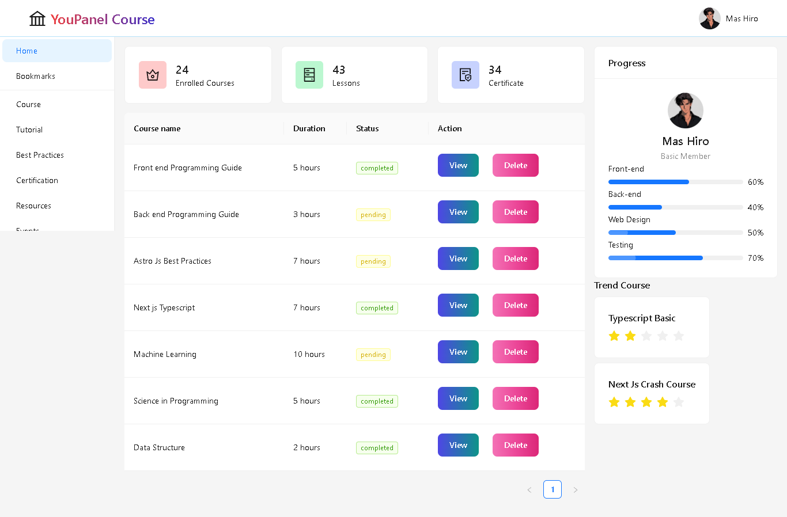

<h1 align="center"> YouPanelCourse </h1>

YouPanel Course is a panel to review a lesson that is used to learn knowledge about programming and others (at this time it is only slicing and is still not fully working).

### Live Demo
[Website Demo](https://youpanelsilicing.vercel.app/)

## Features
### Website
- Dashboard displaying enrolled courses, lessons, and certificates.
- Course list with status and action buttons for view and delete.
- User profile section with progress bars for different skills.
- Trend courses section highlighting popular courses.

## Technologies Used
### Website
- **Next.js**: React framework for server-side rendering and static site generation.
- **Tailwind CSS**: For styling and layout customization.
- **Ant Design**: UI library for React applications.

## Contribution
Feel free to contribute at [Contribution Guidelines](CONTRIBUTING.md)

## License
This project is licensed under the [MIT License](LICENSE).
